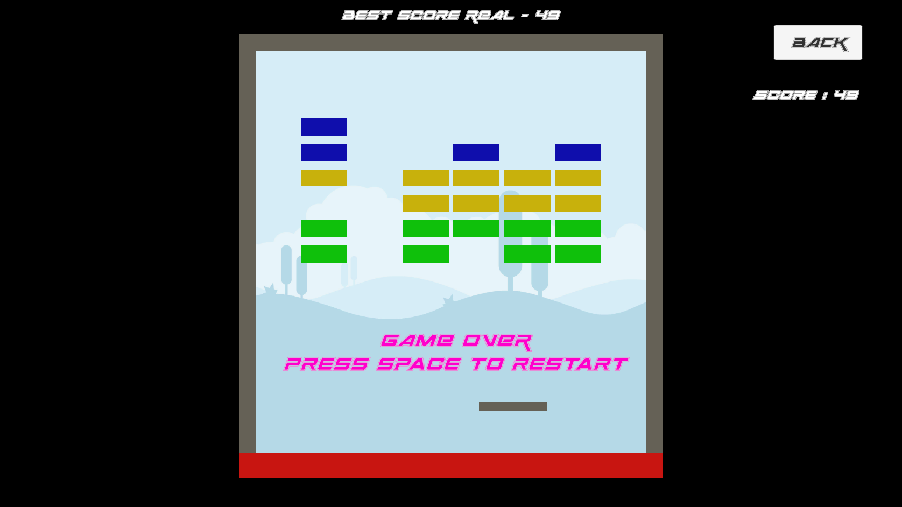

# Data Persistence Unity Project
 Exercice from learn.unity.com Junior Programmer path

* Added menu scene with player input field and background selection
* Made player name and selected backgroud persistent between scenes
* Made high-score and highest player name peristent between sessions
* New UI with TextMeshPro and assets from Kenney Game Assets

Click image below to play:

